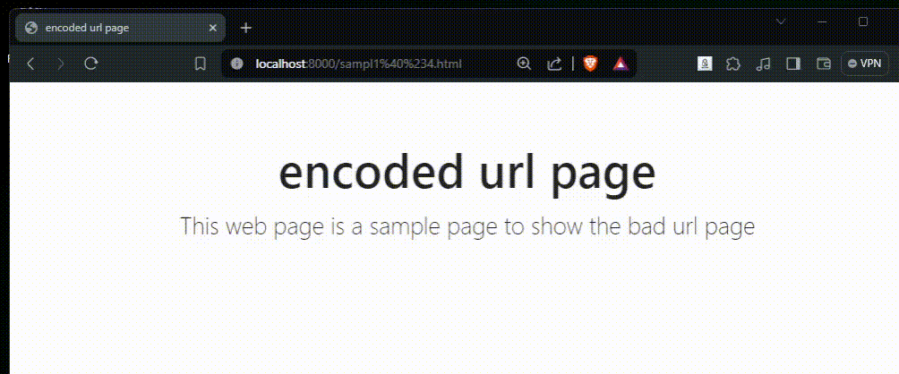

# URL Decoder Chrome Extension

This is a Chrome extension that decodes the URL of the current page shows you the decoded url and also allows you copy the decoded url text.

A URL (Uniform Resource Locator) is a specific type of Uniform Resource Identifier (URI) that provides the address of a resource on the internet and a mechanism for retrieving it. The URL specification, also known as the URL Standard, defines the structure of URLs, domains, IP addresses, and their API. It was formulated to make URLs fully interoperable. What happens if the url are typically.

A URL is composed from a limited set of characters belonging to the US-ASCII character set. These characters include digits (0-9), letters(A-Z, a-z), and a few special characters ("-", ".", "_", "~"). So many services will return an encoded url string back. For example: `https://example.com/hello%20world` is encoded for the actual url as `https://example.com/hello world` the `%20` us a space. So might need to decode this url string and get parameters accurately so that you get understand what a website is sending you.

## Features

- Decodes the URL of the current page.
- Copies the decoded URL to the clipboard.

## Usage

1. Click the extension's button in the toolbar to open the popup.
2. Click the "Decode URL" button to decode the URL of the current page.
3. Click the "Copy to Clipboard" button to copy the decoded URL to the clipboard.

## Contributing

We welcome contributions from the community and are pleased to have you join us. Here are some guidelines that will help you get started:

1. Code of Conduct: By participating in this project, you agree to abide by its Code of Conduct.

2. Getting Started: Take a look at the open issues for areas where you can contribute. Issues labeled good first issue are a great place to start.

3. Fork and Clone: Fork the project to your GitHub account and clone your fork to your local machine.

4. Environment Setup: Follow the setup instructions in the project README to get your development environment ready.

5. Branching Strategy: Create a new branch for each feature, improvement, or bug fix. Use a descriptive name for your branch, such as feature/add-search-functionality or fix/login-issue.

6. Make Changes: Implement your changes, adhering to the coding standards and guidelines mentioned in the project documentation.

7. Write Tests: Ensure that your changes are accompanied by tests, if applicable. Run the existing test suite to ensure that your changes do not break existing functionality.

8. Commit Messages: Write clear and meaningful commit messages. Include a brief description of the changes and reference related issue numbers if any.

9. Submit a Pull Request (PR): Push your changes to your fork and submit a pull request to the main project. Provide a detailed description of the changes and reference the related issue(s).

10. PR Review: Wait for the PR review. Be open to feedback and make necessary adjustments. Your PR may require several rounds of review and updates before merging.

## License

Copyright 2024 elephanta technologies and design inc (elephantatech) (Vivek Mistry)

   Licensed under the Apache License, Version 2.0 (the "License");
   you may not use this file except in compliance with the License.
   You may obtain a copy of the License at

   [http://www.apache.org/licenses/LICENSE-2.0](http://www.apache.org/licenses/LICENSE-2.0)

   Unless required by applicable law or agreed to in writing, software
   distributed under the License is distributed on an "AS IS" BASIS,
   WITHOUT WARRANTIES OR CONDITIONS OF ANY KIND, either express or implied.
   See the License for the specific language governing permissions and
   limitations under the License.
